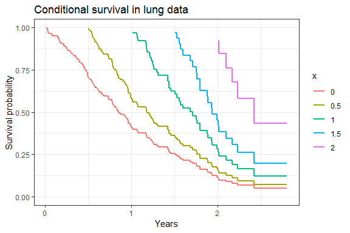

<!-- README.md is generated from README.Rmd. Please edit that file -->

# condsurv

This package contains a function for generating conditional survival
estimates with associated confidence intervals, and a function for
plotting conditional survival curves.

Install the package using

``` r
remotes::install_github("zabore/condsurv")
```

# Conditional survival

If \(S(t)\) represents the survival function at time \(t\), then
conditional survival is defined as

\[S(y|x) = \frac{S(x + y)}{S(x)}\]

where \(y\) is the number of additional survival years of interest and
\(x\) is the number of years a subject has already survived.

## Generating conditional survival estimates

The `conditional_surv_est` function will generate this estimate along
with 95% confidence intervals.

The `lung` dataset from the `survival` package will be used to
illustrate.

``` r
library(survival)
library(dplyr)

# Scale the time variable to be in years rather than days
lung2 <- 
  mutate(
    lung,
    os_yrs = time / 365.25
  )
```

First generate a single conditional survival estimate. This is the
conditional survival of surviving to 1 year conditioned on already
having survived 6 months. This returns a list, where `cs_est` is the
conditional survival estimate, `cs_lci` is the lower bound of the 95%
confidence interval and `cs_uci` is the upper bound of the 95%
confidence interval.

``` r
library(condsurv)

myfit <- survfit(Surv(os_yrs, status) ~ 1, data = lung2)

conditional_surv_est(
  basekm = myfit,
  t1 = 0.5, 
  t2 = 1
)
```

    ## $cs_est
    ## [1] 0.58
    ## 
    ## $cs_lci
    ## [1] 0.49
    ## 
    ## $cs_uci
    ## [1] 0.66

You can easily use `purrr::map_df` to get a table of estimates for
multiple timepoints. For example we could get the conditional survival
estimate of surviving to a variety of different time points given that
the subject has already survived for 6 months (0.5 years).

``` r
prob_times <- seq(1, 2.5, 0.5)

purrr::map_df(
  prob_times, 
  ~conditional_surv_est(
    basekm = myfit, 
    t1 = 0.5, 
    t2 = .x) 
  ) %>% 
  mutate(years = prob_times) %>% 
  select(years, everything()) %>% 
  knitr::kable()
```

| years | cs\_est | cs\_lci | cs\_uci |
| ----: | ------: | ------: | ------: |
|   1.0 |    0.58 |    0.49 |    0.66 |
|   1.5 |    0.36 |    0.27 |    0.45 |
|   2.0 |    0.16 |    0.09 |    0.24 |
|   2.5 |    0.07 |    0.01 |    0.13 |

## Plotting conditional survival curves

To plot the conditional survival curves at baseline, and for those who
have survived 6 months, 1 year, 1.5 years, and 2 years, we use the
`gg_conditional_surv` function.

``` r
cond_times <- seq(0, 2, 0.5)

gg_conditional_surv(
  basekm = myfit, 
  at = cond_times,
  main = "Conditional survival in lung data"
  ) 
```

<!-- -->
